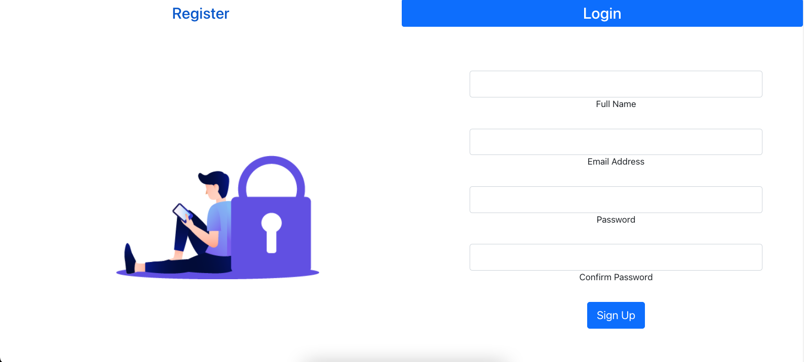
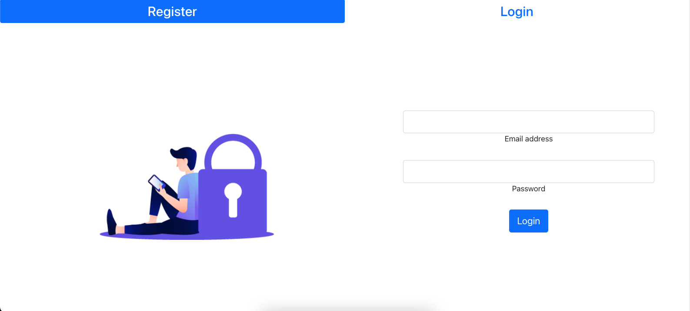
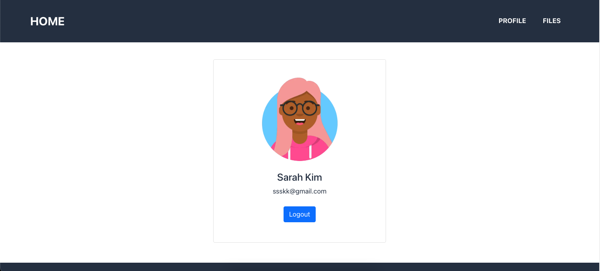
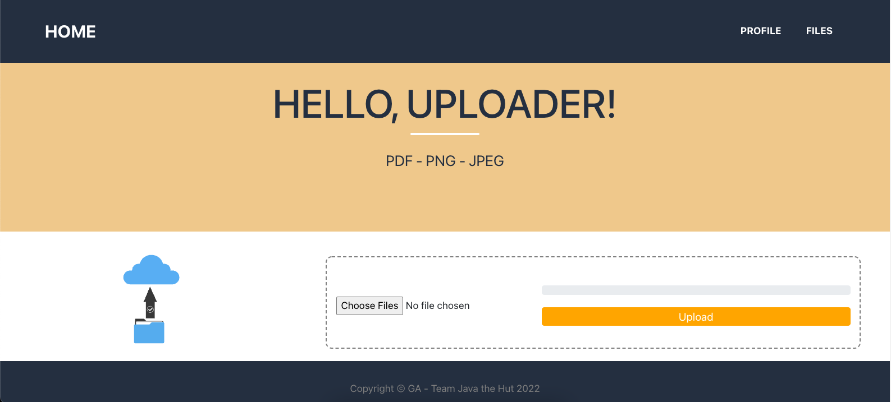
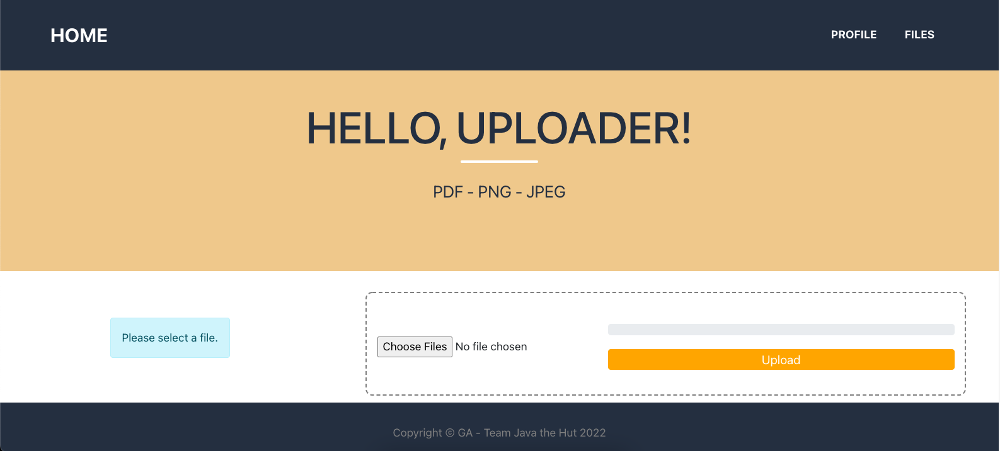
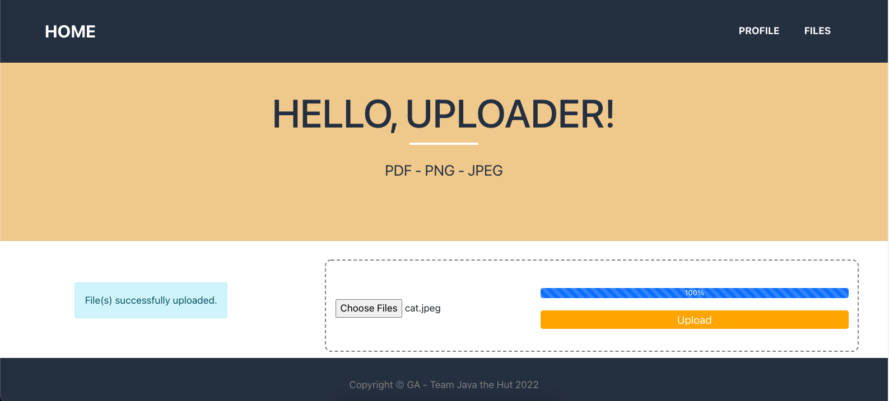
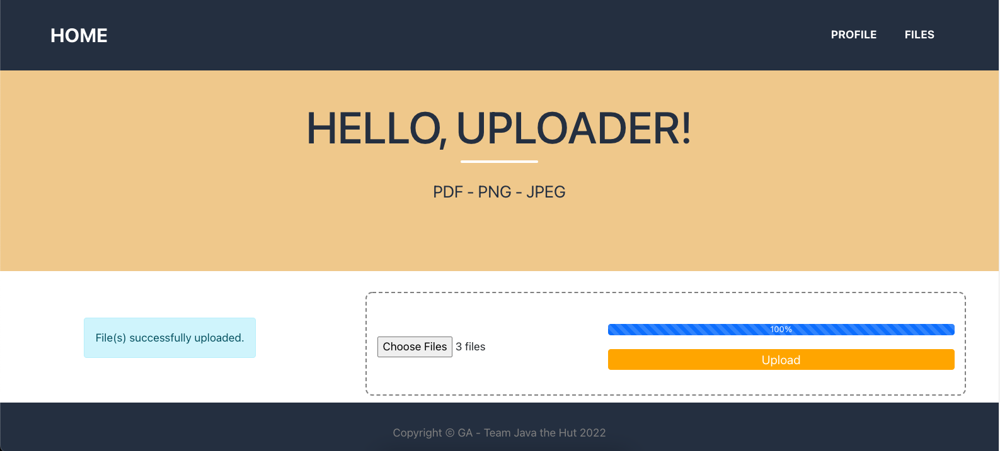
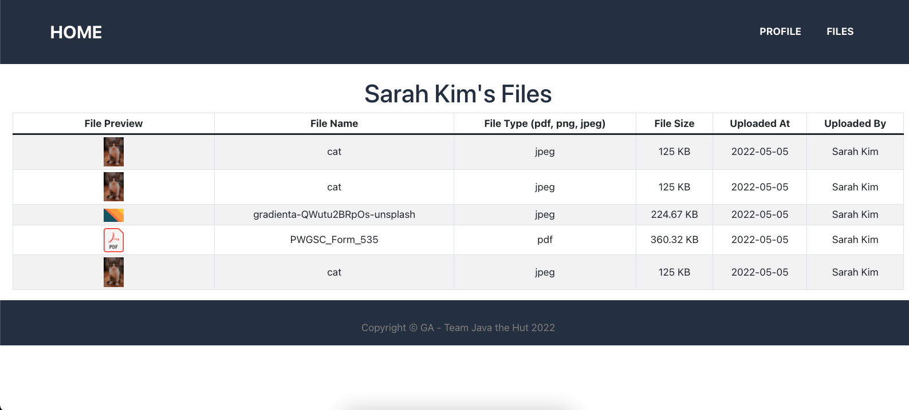

# Hello, Uploader!

Hello, world? Hello, Uploader!

"Hello, Uploader!" is a file-uploading MERN stack application that allows for multiple file uploads and saves user images/pdfs.

---

### **Collaborators**

This project was created in collaboration with:

- [Zahra Abdulrashid](https://github.com/zarax7)

---

### **Screenshots**

---

### **Technologies Used**

- Javascript
- HTML
- CSS
- MongoDB, MongDB Atlas
- Express
- Node.js
- React
- Bootstrap
- AWS
- S3 Buckets
- Visual Studio Code

---

### **Getting Started**

http://54.234.202.208:3001/

To start using "Hello, Uploader!", a log in or sign up is required. From there, users will be redirected to the main page where the real fun can begin.

Using the easy to navigate interface, users can select a file (or files) to be uploaded, by simply clicking the "Choose Files" button. Once the "Upload" button is clicked, the file will be saved with the help of S3 buckets and MongoDB Atlas.

Uploaded files can be viewed along with the associated metadata in the "Files" page, making it easy for users to keep track of all their favourite uploads even after you log out!

Note - "Hello, Uploader!" only accepts PDF, PNG, and JPEG files.

---

### **Next Steps**

- Implement "drag and drop" functionality for file uploading.
- Allow for preview of PDFs.
- Allow for user account password resetting.
- Allow for file downloading.
- Include OAUTH for sign in.
